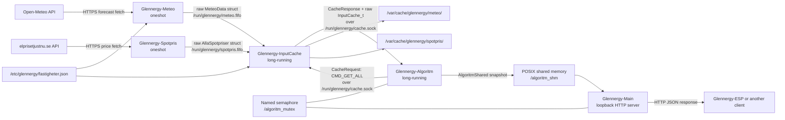
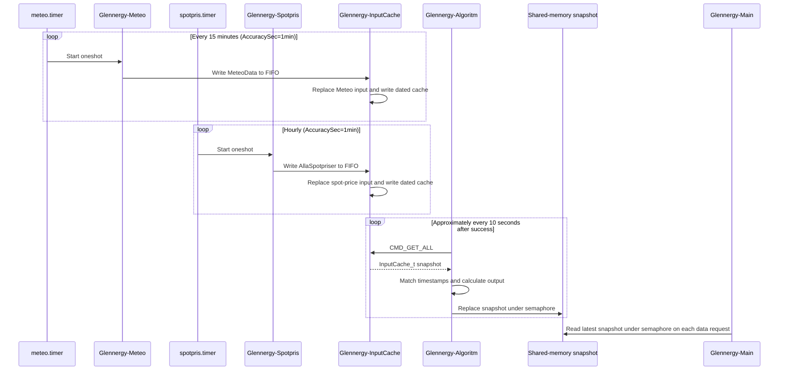

# Glennergy server architecture

> **In short:** Five executables exchange property, weather, price and result
> snapshots through shared memory, semaphores, a FIFO and a Unix socket.

This document describes the Linux server stack implemented on `dev`. It is a
server-internal companion to the canonical cross-project documents maintained
by Glennergy-ESP:

- [Glennergy system context](https://github.com/Glennergy-Optimizer/Glennergy-ESP/blob/dev/docs/system-context.md)
- [Glennergy HTTP API reference](http-api.md)
- [Glennergy-ESP consumer interface contract](https://github.com/Glennergy-Optimizer/Glennergy-ESP/blob/dev/docs/interface-contract.md)
- [Current limitations and planned work](https://github.com/Glennergy-Optimizer/Glennergy-ESP/blob/dev/docs/current-limitations.md)

These are intended cross-repository GitHub links. They resolve after the
documentation branch is merged to Glennergy-ESP `dev`; reviewers working only
with local sibling checkouts should open those paths in the Glennergy-ESP
repository directly.

`origin/main` is the stable-production reference, but it predates the current
systemd units and several reliability changes. Therefore, operational details
below must not be assumed to describe an installation made from
`origin/main`. The five executable roles and their basic data path are present
there, while service supervision, runtime paths and some failure handling
differ.

## Architecture at a glance

Glennergy runs five cooperating executables. Two short-lived fetchers obtain
external data. InputCache owns the in-memory input snapshot. Algorithm converts
that snapshot into per-property output. The HTTP server publishes the latest
Algorithm snapshot to clients.

## Process responsibilities and ownership

| Executable | Lifetime | Owns | Reads | Publishes |
|---|---|---|---|---|
| `Glennergy-InputCache` | Long-running | Mutable `InputCache_t` input snapshot, cache Unix socket, both FIFO read ends, dated cache files | Property configuration and fetcher FIFO messages | Raw cache responses over `/run/glennergy/cache.sock` |
| `Glennergy-Meteo` | systemd oneshot every 15 minutes | One fetch attempt and its temporary `MeteoData` object | Property configuration and Open-Meteo | One raw `MeteoData` message to `meteo.fifo` |
| `Glennergy-Spotpris` | systemd oneshot hourly | One fetch attempt and its temporary `AllaSpotpriser` object | Public Swedish spot-price API | One raw `AllaSpotpriser` message to `spotpris.fifo` |
| `Glennergy-Algoritm` | Long-running | Calculated `AlgoritmShared` snapshot; creation of shared memory and named semaphore | Full `InputCache_t` snapshot through the cache socket | Replaces shared-memory contents under the semaphore about every 10 seconds after successful input retrieval |
| `Glennergy-Main` | Long-running | Loopback listener, worker pool and HTTP request lifecycle | `AlgoritmShared` under the named semaphore | JSON HTTP responses |

The property file is configuration rather than runtime registration storage in
the current implementation. InputCache and Meteo read it; no current server
path accepts registration from an ESP or writes newly registered properties.
Five result slots are a temporary test limit (`MAX_ID == 5`), not a final
capacity promise.

### InputCache

InputCache loads `/etc/glennergy/fastigheter.json` at startup, creates or opens
the two FIFOs, binds the Unix socket and then multiplexes all three descriptors
with `select()`. It is the only process that mutates the combined input
snapshot. On successful fetcher messages it also writes dated JSON cache files
below `/var/cache/glennergy/meteo` and `/var/cache/glennergy/spotpris`.

Socket clients can request the full snapshot, Meteo only, Spotpris only, or a
ping. Algorithm currently uses only `CMD_GET_ALL`. InputCache handles accepted
cache clients synchronously in its event loop; a slow or partial client can
therefore delay other FIFO and socket work.

### Meteo and Spotpris fetchers

Meteo reads all configured property locations, makes a blocking request to
Open-Meteo and writes one fixed-size `MeteoData` structure. Spotpris fetches
price arrays for Swedish areas SE1–SE4 from `elprisetjustnu.se` and writes one
fixed-size `AllaSpotpriser` structure. Opening either FIFO for writing blocks
until InputCache has its read end open; the systemd dependency on InputCache is
therefore significant.

Neither fetcher remains resident after a successful or failed attempt. Their
next ordinary execution is controlled by the timer, although a persistent
timer can catch up a missed activation after the host resumes.

### Algorithm

Algorithm requests a complete `InputCache_t` snapshot through the Unix socket.
If the request fails, it waits five seconds and retries without publishing a
new snapshot. After a successful read, it matches weather and price samples by
timestamp and electricity area, prepares a zero-initialized next snapshot,
then copies the whole result to shared memory while holding
`/algoritm_mutex`. It sleeps ten seconds between successful cycles.

Each recommendation entry publishes a continuous min/max-normalized `score`
and a separate quartile category. The category is `buy` below Q25, `hold`
between Q25 and Q75, and `sell` at or above Q75. Both the min/max normalization
and quartile thresholds are calculated from the published forward window only:
the current matched quarter-hour interval plus up to 127 future intervals.
Earlier cached prices and later, unpublished cached prices are excluded.

### HTTP server

`Glennergy-Main` binds IPv4 loopback (`127.0.0.1`) on the configured port; the
systemd unit supplies port `8080`. A non-blocking listener is polled by the
server work loop and accepted sockets are queued to a fixed worker pool. Each
valid data request maps the shared-memory snapshot, opens the named semaphore,
holds it while producing the JSON array, and returns the result.

The repository does not contain the external reverse-proxy configuration. It
therefore proves neither the public hostname nor TLS, firewall, DNS or proxy
behavior. Production endpoint addresses are intentionally omitted.

The request/response syntax belongs in the canonical server
[HTTP API reference](http-api.md), not in this process document. Firmware-side
parsing and cache consequences remain in the synchronized
[Glennergy-ESP interface contract](https://github.com/Glennergy-Optimizer/Glennergy-ESP/blob/dev/docs/interface-contract.md).

## IPC contracts and ABI sensitivity

The internal transports do not serialize versioned messages. They copy native
C/C++ structures as bytes:

| Boundary | Framing | Shared definitions | Compatibility requirement |
|---|---|---|---|
| Meteo → InputCache | One raw `MeteoData` over FIFO | Meteo headers consumed by both processes | Same structure layout, array sizes, scalar sizes, alignment and compiler ABI |
| Spotpris → InputCache | One raw `AllaSpotpriser` over FIFO | `API/Spotpris/Spotpris.h` | Same structure layout and ABI |
| Algorithm ↔ InputCache | `CacheRequest`, then `CacheResponse`, then a raw payload over Unix stream socket | `Cache/CacheProtocol.h` and `Cache/InputCache.h` | Same enum values, header layout, payload type and exact expected size |
| Algorithm → HTTP server | Raw `AlgoritmShared` in POSIX shared memory | `Algorithm/AlgoritmProtocol.h` | Same layout, `MAX_ID`, array lengths and synchronization names |

All five binaries must be rebuilt and deployed as one compatible release when
any transported structure changes. The socket is local, so the source comment
about network byte order does not make the current structs portable: fields
are sent in host representation and no schema or protocol version is carried.
Algorithm does not validate `CacheResponse.data_size`; it reads its own
locally expected payload size. Mixed releases can therefore silently
misinterpret equal-size layouts, fail on a short read, or block waiting for
bytes until the peer closes the connection. The current exchange does not
reject incompatible layouts through a response-size check.

The shared-memory writer creates `/algoritm_shm`; both Algorithm and the HTTP
server coordinate access with `/algoritm_mutex`. This semaphore protects the
snapshot copy/read, but it does not validate snapshot freshness or schema
version.

## Scheduling and refresh timing

The diagram shows configured triggers, not guaranteed end-to-end freshness.
External request time, FIFO blocking, timer accuracy, failures and the
Algorithm cycle add latency. Algorithm retries a failed cache request after
five seconds.

## Startup and readiness

`glennergy.target` requires InputCache, Algorithm and the HTTP server, and wants
the two timers. The dependency graph orders Algorithm after InputCache and the
HTTP server after both. Fetcher services also require and start after
InputCache, plus `network-online.target`.

Ordering is not an application-level readiness handshake:

- systemd considers each long-running service started after its process is
  launched; it does not probe the cache socket or shared-memory contents;
- Algorithm may start before InputCache has bound `/run/glennergy/cache.sock`,
  then recover through its five-second retry;
- the HTTP listener may become available before Algorithm has published useful
  data;
- a timer-triggered fetcher can block opening its FIFO until InputCache has
  opened the read end, subject to its 45-second start timeout;
- InputCache and Meteo refuse startup when the property configuration is not
  readable.

Consumers must not interpret “HTTP port accepts a connection” as proof that
weather, price and recommendation data are fresh.

## Failure, restart and cache behavior

The three long-running units use `Restart=on-failure`, a five-second restart
delay and a limit of five starts per 60 seconds. The two fetchers are oneshots;
their services do not declare automatic restart, so an unsuccessful run waits
for a later timer activation unless an operator starts it manually.

Important current limitations are:

- InputCache state is primarily in memory. A restart reloads properties but
  does not restore the dated Meteo/Spotpris JSON cache files into its live
  snapshot.
- The dated cache files are operational records, not a restart recovery source
  in current code.
- A failed fetch does not replace InputCache data; already held values can
  remain, but no general freshness metadata is exposed to HTTP clients.
- Algorithm preserves its last shared-memory snapshot when it cannot obtain a
  fresh cache snapshot. It clears stale slots only after a successful cache
  read and new computation.
- Restarting Algorithm recreates/opens shared IPC, but neither systemd ordering
  nor the API reports when the first complete result is ready.
- The HTTP server returns what is currently in shared memory and does not
  independently assess provider availability or age.
- Raw-structure IPC makes partial deployment unsafe.
- Capacity is currently bounded by several fixed arrays; the five-property
  result limit is temporary test behavior.
- Property registration, UUID-based device identity and authorization are
  planned and are not part of this architecture yet.

For cross-project limitations, including the temporary endpoint shape and the
non-final recommendation product policy, use the canonical
[limitations document](https://github.com/Glennergy-Optimizer/Glennergy-ESP/blob/dev/docs/current-limitations.md).

## Source map

Verification metadata

| Item | Value |
| --- | --- |
| Status | Current development architecture |
| Authoritative snapshot | `dev` at `63b1bad306d172e3d8cd337b314843f656715887` |
| Stable-production comparison | `origin/main` at `61761b5eda30bee417a0b6e33e10fb061e18db26` |
| Last evidence review | 2026-08-03 |

| Concern | Primary evidence |
|---|---|
| Production executables and installation layout | [`Makefile`](../Makefile) |
| systemd topology and schedules | [`systemd/`](../systemd/) |
| Runtime paths | [`Libs/GlennergyPaths.h`](../Libs/GlennergyPaths.h) |
| Input ownership and event loop | [`Cache/main.c`](../Cache/main.c), [`Cache/InputCache.c`](../Cache/InputCache.c) |
| Cache request protocol | [`Cache/CacheProtocol.h`](../Cache/CacheProtocol.h) |
| Algorithm cycle and output publication | [`Algorithm/main.c`](../Algorithm/main.c), [`Algorithm/AlgoritmProtocol.h`](../Algorithm/AlgoritmProtocol.h) |
| HTTP listener and worker ownership | [`Server/Server.c`](../Server/Server.c), [`Server/TCPServer.c`](../Server/TCPServer.c), [`Server/Connection/Connection.c`](../Server/Connection/Connection.c) |
| Weather provider | [`API/Meteocpp/`](../API/Meteocpp/) |
| Price provider | [`API/Spotpris/`](../API/Spotpris/) |

## Known uncertainty

The current implementation defines a normalized score and quartile category,
but does not establish those categories as the final product decision policy.
This document also does not claim that the checked-in
systemd topology has been observed on the production host: repository evidence
establishes the intended `dev` deployment, while `origin/main` remains the
stable-production code reference. Runtime deployment state must be verified
separately without exposing production addresses or credentials.
